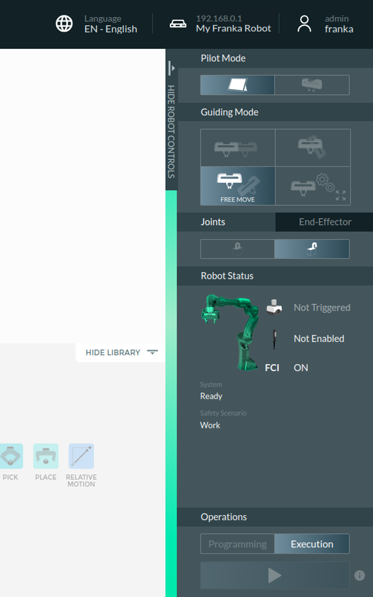
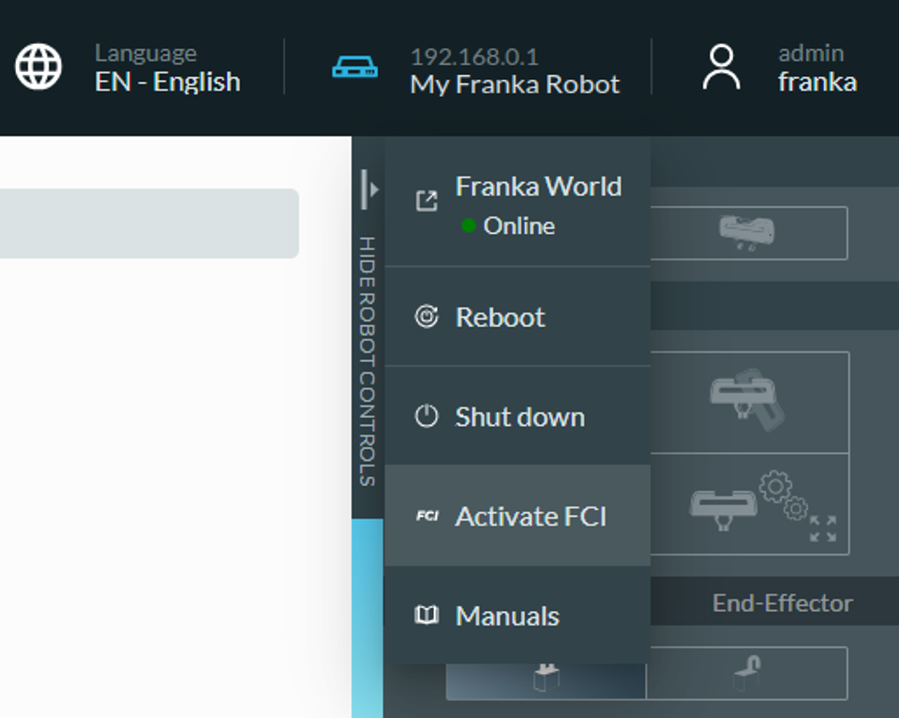

# Start Franka
- [ ] 进入上位机 ubuntu2，rt系统，Passward: 
- [ ] 打开franka控制器
- [ ] 登录franka图形控制界面（e.g. 171.16.0.3）
- [ ] 激活关节

- [ ] 启动FCI模式

# ROS integration for Franka Robotics research robots

See the [Franka Control Interface (FCI) documentation][fci-docs] for more information.

## License

All packages of `franka_ros` are licensed under the [Apache 2.0 license][apache-2.0].

[apache-2.0]: https://www.apache.org/licenses/LICENSE-2.0.html
[fci-docs]: https://frankaemika.github.io/docs
## install 
After setting up ROS Noetic, create a Catkin workspace in a directory of your choice:
``` shell
cd /path/to/desired/folder
mkdir -p catkin_ws/src
cd catkin_ws
source /opt/ros/noetic/setup.sh
catkin_init_workspace src
```

Then clone the franka_ros repository from GitHub:
``` shell
git clone --recursive https://github.com/frankaemika/franka_ros src/franka_ros
```
By default, this will check out the newest release of franka_ros. If you want to build a particular version of franka_ros instead, check out the corresponding Git tag:
``` shell
git checkout <version>
```
Install any missing dependencies and build the packages:
``` shell
rosdep install --from-paths src --ignore-src --rosdistro noetic -y --skip-keys libfranka
catkin_make -DCMAKE_BUILD_TYPE=Release -DFranka_DIR:PATH=/path/to/libfranka/build
source devel/setup.sh
```
Note: If you have installed a franka ros before, you can get libfranka in its build cmakecache.txt
Warning

If you also installed ros-noetic-libfranka, libfranka might be picked up from /opt/ros/noetic instead of from your custom libfranka build!

## use

```
source devel/setup.sh
```
cartesian_impedance_controller
```
roslanch franka_example_controllers cartesian_impedance_controller.launch load_gripper:=true robot_ip:=172.16.0.3 
```

rostopic pub test

``` shell
rostopic pub /joint_impedance_example_controller/joint_command std_msgs/Float64MultiArray "data: [1., -0.16, -0.23, -1.96, -0.152, 1.8, 1.98, 0.04, 0.04]"
```
## some issues may 
只出现话题没有消息，请检查/etc/hosts设置